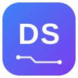
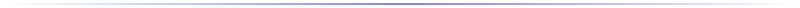

### Dor Shacham

 If it catches me, I take it apart until I understand it.
 
 Knowledge obtainer. All of it, eventually.
 
 Nocturnal by design.

<b>Projects</b> · all three private for now, so nothing to click. Ask if you want a look.
 
**speakos-textos** · desktop speech-to-text, fully on-device
 
**MyClaudeKit** · commands, skills, and workflows for Claude Code
 
**D5Blog** · personal blog

**Languages** &nbsp;    
 
**Frameworks** &nbsp;   
 
**AI tooling** &nbsp;  
 
**Environment** &nbsp;  

 

